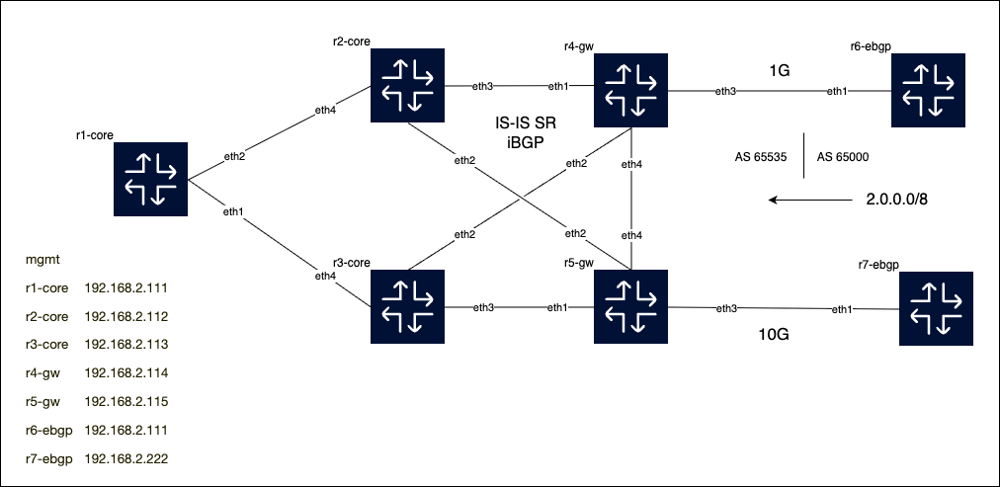

# SR-UCMP

## Introduction

EOS lab to play with segment routing and UnEqual Cost Multi-Path (UCMP), it ws build using Containerlab. The configurations are just for the purpose of the lab, they are not hardened/etc...

## How to Install

1. Clone this repository:
   ```sh
   git clone https://github.com/yourusername/sr-ucmp.git
   cd sr-ucmp
   ```
2. Install [Containerlab](https://containerlab.dev/install/).
3. Ensure Docker is installed and running on your system.

## Containerlab

Containerlab is used to deploy and manage the network topology for this project. To start the lab, run:
```sh
containerlab deploy -t topology.clab.yaml
```
To destroy the lab:
```sh
containerlab destroy -t topology.clab.yaml
```

## Network Topology

The following diagram shows the network topology used in this project:

[](img/topology.clab.drawio.png)
